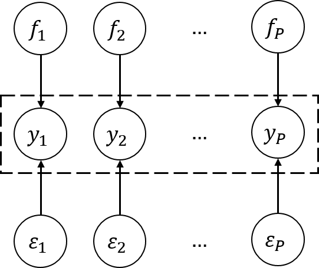
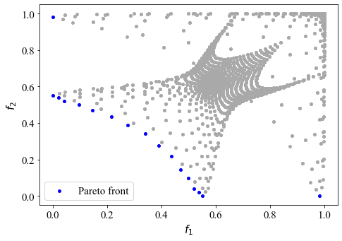
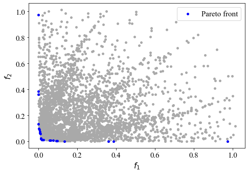
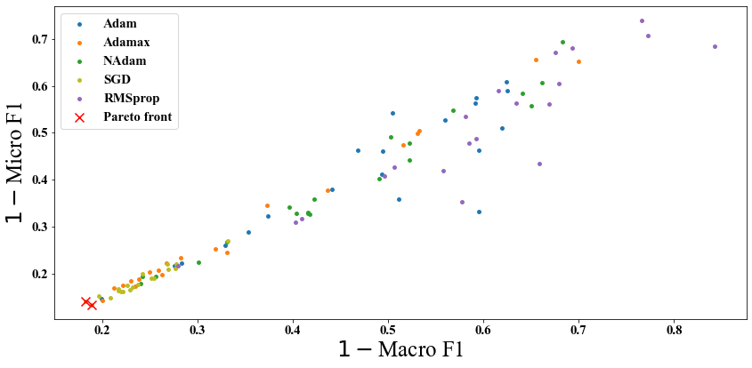
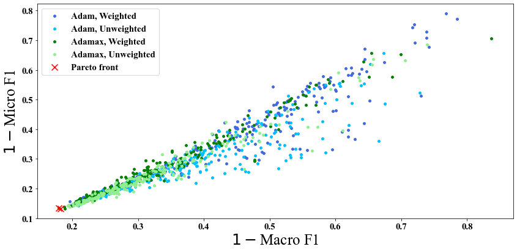

# Computer Experiment

## Introduction
This project mainly focuses on surrogate-assisted tuning procedures for qualitative and quantitative factors in multiple response models with noises. Basically, a surrogate-assistant approach iterates the following two steps until a stop criterion is met. First based on the current explored points, a surrogate surface is constructed and then due to the surrogate model, an infill criterion is adopted to identify the next explored point.

Mainly component in our tuning procedures:
- Initial design (sliced Latin hypercube design)
- Surrogate model (multi-output Gaussian process)
- Infill criteria (hypervolume-based expected improvement)

## Methods
### Optimal sliced Latin hypercube design
`SliceLatinHypercubeDesign.R`
### Multi-output Gaussian process model
- Multi-objective Gaussian process with qualitative and quantitative factors (`model/MOQQGP.py`)

<p align="center">
  
</p>

- Multi-task Gaussian process with qualitative and quantitative factors (`model/MTQQGP.py`)

<p align="center">
  
</p>

### Expected hypervolume improvement
`utils/EHVI.py`
- Observed-based (OEHVI)
- Posterior-based (PEHVI)

## Materials
### Numerical experiment

- Case1: highly correlated
    <p align="center">
    
    </p>
    Data generating

    ```r
    python3 numerical_experiment/case1.py --GridSize --RandomSeed --SampleSize --ModelName --NoiseSigma --PosteriorPateto
    ```
- Case2: slightly correlated
    <p align="center">
    <br >
    
    <br >
    </p>
    Data generating

    ```r
    python3 numerical_experiment/case1.py --GridSize --RandomSeed --SampleSize --ModelName --NoiseSigma --PosteriorPateto
    ```

### Real experiment

- Data (metrics) generating
    ```r
    python3 numerical_experiment/case1.py --GridSize --RandomSeed --SampleSize --ModelName --NoiseSigma --PosteriorPateto
    ```

- Case1
    - Qualitative factors:
        - Optimizer: 5-levels
    - Quantitative factors:
        - Learning rate

    <p align="center">
    <br >
    
    <br >
    </p>

    ```r
    python3 real_experiment/case1.py --RandomSeed --SampleSize --ModelName --NoiseSigma --PosteriorPateto
    ```

- Case2
    - Qualitative factors:
        - Optimizer: 2-levels
        - Weighted loss: 2-levels
    - Quantitative factors:
        - Learning rate
        - Decay rate (lower)
    
    <p align="center">
    <br >
    
    <br >
    </p>

    ```r
    python3 real_experiment/case2.py --RandomSeed --SampleSize --ModelName --NoiseSigma --PosteriorPateto
    ```

## Results

### Numerical experiment

- `summary_result/numerical_case1.ipynb`
- `summary_result/numerical_case2.ipynb`

### Real experiment

- `summary_result/real_case1.ipynb`
- `summary_result/real_case2.ipynb`