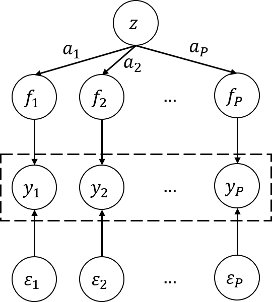

# Computer Experiment: Surrogate-Assisted Tuning Procedure With Qualitative and Quantitative Factors for Multiple Responses

## Introduction
This project mainly focuses on surrogate-assisted tuning procedures for qualitative and quantitative factors in multiple response models with noises. Basically, a surrogate-assistant approach iterates the following two steps until a stop criterion is met. First based on the current explored points, a surrogate surface is constructed and then due to the surrogate model, an infill criterion is adopted to identify the next explored point.

Mainly component in our tuning procedures:
- Initial design (sliced Latin hypercube design)
- Surrogate model (multi-output Gaussian process)
- Infill criteria (hypervolume-based expected improvement)

## Methods
### Optimal sliced Latin hypercube design
`SliceLatinHypercubeDesign.R`
### Multi-output Gaussian process model
- Multi-objective Gaussian process with qualitative and quantitative factors (`model/MOQQGP.py`)

<p align="center">
  
</p>

- Multi-task Gaussian process with qualitative and quantitative factors (`model/MTQQGP.py`)

<p align="center">
  
</p>

### Expected hypervolume improvement
`utils/EHVI.py`
- Observed-based (OEHVI)
- Posterior-based (PEHVI)

## Materials
### Numerical experiment
We repeat each experiment 20 times by independently generating the initial points. Finally, we store the experimental data (each step) about the computation time, the change of the maximum EI value, and the contribution ratio (compared to the real Pareto set).
- Case1: highly correlated

    Experiment result generating

    ```r
    python3 numerical_experiment/case1.py --GridSize --RandomSeed --SampleSize --ModelName --NoiseSigma --PosteriorPateto
    ```

    Scatter plot
    <p align="center">
    <br >
    
    <br >
    </p>

- Case2: slightly correlated

    Experiment result generating

    ```r
    python3 numerical_experiment/case2.py --GridSize --RandomSeed --SampleSize --ModelName --NoiseSigma --PosteriorPateto
    ```

    Scatter plot
    <p align="center">
    <br >
    
    <br >
    </p>

### Real experiment

- Data (metrics) generating
    ```r
    python3 resnet_data_generate_process.py ---algorithm --weighted --lr --low_beta --up_beta --momentum
    ```

    - Case1
        - Qualitative factors:
            - Optimizer: 5-levels
        - Quantitative factors:
            - Learning rate

        <p align="center">
        <br >
        
        <br >
        </p>

    - Case2
        - Qualitative factors:
            - Optimizer: 2-levels
            - Weighted loss: 2-levels
        - Quantitative factors:
            - Learning rate
            - Decay rate (lower)
        
        <p align="center">
        <br >
        
        <br >
        </p>

We repeat each experiment 20 times by independently generating the initial points. Finally, we store the experimental data (each step) about the computation time, the change of the maximum EI value, and the contribution ratio (compared to the real Pareto set).

- Case1

    Experiment result generating
    ```r
    python3 real_experiment/case1.py --RandomSeed --SampleSize --ModelName --NoiseSigma --PosteriorPateto
    ```

- Case2

    Experiment result generating
    ```r
    python3 real_experiment/case2.py --RandomSeed --SampleSize --ModelName --NoiseSigma --PosteriorPateto
    ```

## Results
Analyze results from (numerical / real) experiments with descriptive statistics
### Numerical experiment

- `summary_result/numerical_case1.ipynb`
- `summary_result/numerical_case2.ipynb`

### Real experiment

- `summary_result/real_case1.ipynb`
- `summary_result/real_case2.ipynb`